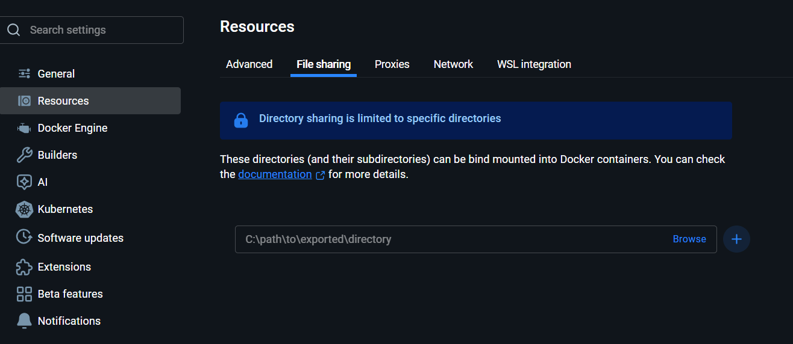

# Aerospike Docker Cluster Setup
This project demonstrates a 2-node Aerospike cluster running on Docker with custom configuration files. 
It also includes instructions for connecting AMC (Aerospike Management Console) to monitor the cluster.
---

Prerequisites

Docker Desktop (Windows / Linux / Mac)

Powershell or any terminal

Docker images:

aerospike/aerospike-server:latest

aerospike/amc:latest (optional, for GUI)

---

```
aerospike-cluster/
├── node1/
│   └── aerospike_mesh.conf
├── node2/
│   └── aerospike_mesh.conf
└── README.md

```

- node1/aerospike_mesh.conf – Configuration for node1

- node2/aerospike_mesh.conf – Configuration for node2

## Step 1: Create Docker Network

```
 
 docker network create aerospike-net

```
Add the path of volumes in docker -> settings -> resources -> file sharing.

## Step 2: Create Configuration Files
Create `aerospike_mesh.conf` files for each node with the following content:
### node1/aerospike_mesh.conf
```
service {
    cluster-name docker-cluster
}

logging {
    console {
        context any info
    }
}

network {
    service {
        address any
        port 3000
        access-address aerospike1      # default advertised IP (Docker clients)
        alternate-access-address 127.0.0.1  # advertised IP for host clients
        access-port 8000
        alternate-access-port 9000
    }

    heartbeat {
        mode mesh
        address any
        port 3002
        interval 150
        timeout 10

        # 👇 Add seed nodes here (other nodes in cluster)
        mesh-seed-address-port aerospike2 3002
        mesh-seed-address-port aerospike3 3002


    }

    fabric {
        address any
        port 3001
    }
}

namespace test {
    replication-factor 3

    storage-engine device {
        file /opt/aerospike/data/test.dat
        filesize 4G
        read-page-cache true
    }
}
```
### node2/aerospike_mesh.conf
```
service {
    cluster-name docker-cluster
}

logging {
    console {
        context any info
    }
}

network {
    service {
        address any
        port 3000
        access-address aerospike2      # default advertised IP (Docker clients)
        alternate-access-address 127.0.0.1  # advertised IP for host clients
        access-port 8001
        alternate-access-port 9001
    }

   heartbeat {
       mode mesh
       address any
       port 3002
       interval 150
       timeout 10

       mesh-seed-address-port aerospike1 3002
       mesh-seed-address-port aerospike3 3002


   }

    fabric {
        address any
        port 3001
    }
}

namespace test {
    replication-factor 3

    storage-engine device {
        file /opt/aerospike/data/test.dat
        filesize 4G
        read-page-cache true
    }
}
```
### node3/aerospike_mesh.conf
```service {
    cluster-name docker-cluster
}

logging {
    console {
        context any info
    }
}

network {
    service {
        address any
        port 3000
        access-address aerospike2      # default advertised IP (Docker clients)
        alternate-access-address 127.0.0.1  # advertised IP for host clients
        access-port 8002
        alternate-access-port 9002
    }

   heartbeat {
       mode mesh
       address any
       port 3002
       interval 150
       timeout 10

       mesh-seed-address-port aerospike1 3002
       mesh-seed-address-port aerospike2 3002

   }

    fabric {
        address any
        port 3001
    }
}

namespace test {
    replication-factor 3

    storage-engine device {
        file /opt/aerospike/data/test.dat
        filesize 4G
        read-page-cache true
    }
}
```


## Step 3: Run Aerospike Nodes
Open a terminal and navigate to the `aerospike-cluster` directory. Run the
following commands to start the Aerospike nodes:
### Start Node 1
```shell
docker run -tid --name aerospike1 --network aerospike-net --hostname aerospike1 ` -v C:\Users\user\Documents\aerospike_2_node_cluster\node1:/opt/aerospike/etc `-p 9000:3000 -p 3001:3001 -p 3002:3002 -p 3003:3003 ` aerospike/aerospike-server --config-file /opt/aerospike/etc/aerospike_mesh.conf
```
### Start Node 2
```bash
docker run -tid --name aerospike2 --network aerospike-net --hostname aerospike2 `
  -v C:\Users\user\Documents\aerospike_2_node_cluster\node2:/opt/aerospike/etc `
  -p 9001:3000 -p 4001:3001 -p 4002:3002 -p 4003:3003 `
  aerospike/aerospike-server --config-file /opt/aerospike/etc/aerospike_mesh.conf
```

### start node 3
```bash
docker run -tid --name aerospike3 --network aerospike-net --hostname aerospike3 `
  -v C:\Users\user\Documents\aerospike_2_node_cluster\node3:/opt/aerospike/etc `
  -p 9002:3000 -p 5001:3001 -p 5002:3002 -p 5003:3003 `
  aerospike/aerospike-server --config-file /opt/aerospike/etc/aerospike_mesh.conf

```
### Verify Cluster
Check the logs of either node to verify that they have formed a cluster:
```
docker inspect --format '{{ .NetworkSettings.Networks.aerospike-net.IPAddress }}' aerospike2
docker logs -f aerospike1
```
Connect node1 to node2 using asinfo:

````
docker exec -ti aerospike1 asinfo -v "tip:host=<node2-ip>;port=3002"
````

### Step 4: (Optional) Run Aerospike Management Console (AMC)

```
docker run -d --name amc --network aerospike-net -p 8081:8081 aerospike/amc
```


